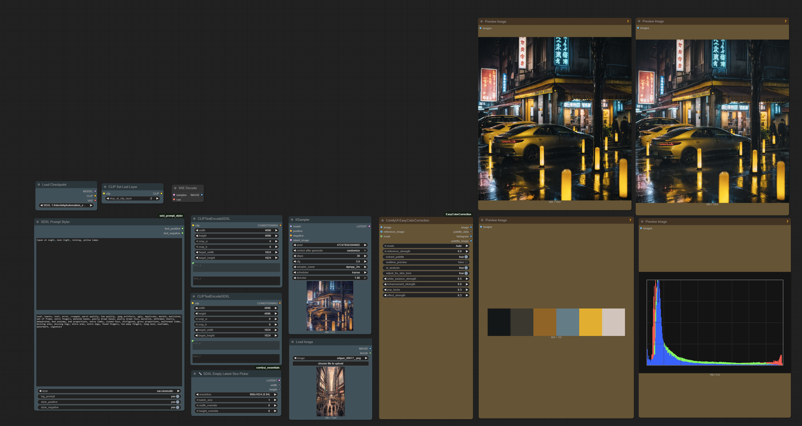

# ComfyUI-EasyColorCorrector 🎨

**Professional-grade AI-powered color correction and enhancement for ComfyUI**

[](https://opensource.org/licenses/MIT)
[](https://www.python.org/downloads/)
[](https://github.com/comfyanonymous/ComfyUI)

>[!WARNING]
> Release v1.2.1 introduces **major refactoring** and **enhancements** and a need name change to **ComfyUI-EasyColorCorrector**. This is a **breaking change** and you will may need to uninstall the old node before installing the new one.

> [!NOTE]
> **Disclaimer**: I'm obviously joking about the "$1000+ plugin" claims and competing with Photoshop - this is a ComfyUI custom node, not industry software! 😄 **BUT** it does have legit AI-powered features, face detection, and professional color science. And hey, it beats paying Adobe! 💰

---

## 🆕 **Latest Updates (Major Update)**

### ✨ **Major Professional Improvements & Fixes**
- **Manual Mode is now truly professional**: Real temperature + tint separation (LAB color space), not just hue sliders
- **Preset Mode is transparent**: Sliders update live to show exactly what each preset does
- **Slider ranges are realistic**: No more wild values—contrast/brightness are now in sensible ranges
- **White Balance is professional**: -1.0 (cool/blue) to +1.0 (warm/orange), like real color grading software
- **Skin tone processing fixed**: No more green tint on light skin—portraits look natural
- **Smart UI**: AI analysis auto-disables in Manual mode for pure manual control
- **Live Preset Updates**: See exactly what each preset does to your sliders
- **2-Axis Color Control**: Separate temperature and tint like the pros use
- **Working 3-Way Correction**: Lift/Gamma/Gain actually works now

### 🆕 **New Nodes (Beta)**
- **Batch Color Corrector**: Process entire video sequences with the same AI-powered corrections
- **RAW Image Processor**: Direct RAW file processing with professional color science
- **Color Correction Viewer**: Real-time preview and analysis for video workflows

> The main Color Corrector is now professional-grade and rock solid. The new nodes are experimental playgrounds for advanced workflows.

---

## 🚀 What is this?
 **ComfyUI-EasyColorCorrector** *is a professional-grade, AI-powered color correction suite that democratizes advanced color grading for the ComfyUI ecosystem.*

**That’s the fancy version.**

**Real talk:** I’m not trying to take over the color correction world. It’s just a node.

 I built it to bridge the gap between **“AI, *do the thing*”** and **“let me tweak this like I’m grading a Netflix series.”**
If it helps artists, creators, and chaos-powered ComfyUI users get better color without paying Adobe or wiring 12 nodes together? Mission accomplished.

If not… hey, at least now you have histograms.


**This node is *opinionated* about color science** - it leverages computer vision, perceptual color spaces, and advanced algorithms to deliver results that rival industry-standard color grading tools.

### 🤯 The TL;DR

- **🤖 AI-Powered**: Face detection, scene analysis, content-aware enhancement
- **🎨 Professional**: LAB color space, 3-way color correction, perceptual curves  
- **⚡ Real-time**: Selective node execution for instant feedback
- **🎛️ Three Modes**: Auto (AI magic), Preset (curated looks), Manual (full control)

---



## ✨ Key Features

### 🤖 **AI-Powered Intelligence**

- **Face Detection**: Automatic skin tone preservation using OpenCV with advanced segmentation
- **Advanced Scene Analysis**: Detects anime, concept art, stylized art, detailed illustrations, portraits, and realistic photos
- **Lighting Detection**: Low-light, bright, flat, optimal lighting analysis
- **Content-Aware Enhancement**: Specialized profiles for artistic content vs. photographic content
- **Edge-Aware Processing**: Multi-scale edge detection with detail preservation
- **Advanced Segmentation**: SLIC-based skin region detection for precise face enhancement

### 🎨 **Professional Color Science**

- **LAB Color Space**: Perceptual white balance and color corrections with Bradford chromatic adaptation
- **K-means Analysis**: Intelligent dominant color extraction in both RGB and LAB spaces
- **3-Way Color Corrector**: Professional lift/gamma/gain controls
- **Perceptual Curves**: Gamma-aware brightness and contrast
- **Advanced Color Matching**: Robust reference image color matching with histogram and LAB methods
- **Professional Color Extraction**: Brightness-sorted palette generation with perceptual spacing

### ⚡ **Performance & Usability**

- **Real-time Preview**: Selective node execution (no full workflow runs)
- **Graceful Fallbacks**: Works without advanced libraries installed
- **Three Distinct Modes**: Each optimized for different use cases
- **Smart UI**: Mode-specific controls with intelligent tooltips
- **Visual Outputs**: Built-in histogram and color palette image generation
- **Multiple Output Types**: Processed image, palette data, histogram image, and palette image

---

## 🎛️ The Three Modes

### 🤖 **Auto Mode: AI Magic**

Just make it look amazing

The AI analyzes your image and applies:

- **Scene-specific enhancement profiles** for 6 content types (anime, concept art, stylized art, detailed illustrations, portraits, realistic photos)
- **Intelligent white balance** in LAB color space
- **Face-aware skin tone preservation** using OpenCV detection
- **Adaptive contrast and saturation** with up to 50% boost for concept art
- **Lighting-aware brightness adjustments** for low-light, bright, flat, and optimal conditions
- **Enhanced glow effects** for artistic content with stronger highlight enhancement

**Perfect for**: Quick enhancement, artistic content, concept art, anime, batch processing

### 🎨 **Preset Mode: Curated Looks**

Give me that specific vibe

30 professional presets with intelligent slider updates:

**Portrait Presets (5)**: Natural, Warm, Cool, High Key, Dramatic  
**Concept Art & Illustration (6)**: Epic Fantasy, Sci-Fi Chrome, Dark Fantasy, Vibrant Concept, Matte Painting, Digital Art  
**Artistic & Stylized (6)**: Anime Bright, Anime Moody, Cyberpunk, Pastel Dreams, Neon Nights, Comic Book  
**Cinematic (5)**: Cinematic, Teal & Orange, Film Noir, Vintage Film, Bleach Bypass  
**Natural (4)**: Golden Hour, Blue Hour, Sunny Day, Overcast  
**Classic (4)**: Sepia, Black & White, Faded, Moody

Enhanced Features:

- **Live slider updates**: Presets automatically update parameter sliders for full transparency
- **Content-aware adaptation**: Presets automatically adjust based on detected scene type
- **Artistic content boost**: Up to 40% enhancement for concept art and illustrations  
- **Smart variation**: Intelligent randomization that respects the original artistic intent

**Perfect for**: Consistent styling, concept art workflows, artistic looks, client work

### 🎛️ **Manual Mode: Professional Control**

*"I know exactly what I want"*

Professional-grade tools with pure manual control:
- **Professional Temperature & Tint**: Separate LAB color space controls (blue↔orange, green↔magenta)
- **3-way color corrector**: Lift/Gamma/Gain with balanced ranges for precise control
- **Intelligent UI**: AI analysis auto-disabled for pure manual workflow
- **Balanced parameter ranges**: Realistic slider ranges that don't break at low values
- **Professional color grading**: Works like Lightroom/DaVinci Resolve
- **Film-like grain** with luminance preservation
- **Enhanced sliders**: Fine-tuned steps for precise adjustments

**Perfect for**: Precision work, professional color grading, learning, complex corrections

---

## 📊 Visual Outputs & Analysis

### 🖼️ **Four Output Types**

The node provides four distinct outputs for maximum workflow flexibility:

1. **📸 Processed Image**: Your enhanced/corrected image
2. **🎨 Palette Data**: Comma-separated hex color string for other nodes
3. **📊 Histogram Image**: RGB histogram visualization (512×768px)
4. **🎨 Palette Image**: Clean color swatches visualization (600×120px)

### 📈 **Histogram Visualization**
- **Professional RGB histogram** with proper scaling and contrast
- **Multi-channel overlay** showing red, green, and blue distributions
- **Dark background** with subtle grid lines for better readability
- **Connect to Preview Image** node to view during processing

### 🌈 **Color Palette Extraction**
- **6 dominant colors** extracted using advanced K-means clustering
- **Perceptual LAB-space analysis** for better color representation
- **Brightness-sorted arrangement** for natural palette flow
- **Clean swatch design** without borders or text clutter
- **Connect to Preview Image** node for instant palette viewing

### 🔧 **Reference Image Color Matching**
- **Robust histogram matching** prevents black spots and artifacts
- **Conservative LAB adjustments** for natural color transitions
- **Multi-method approach** with safe fallbacks
- **Strength control** from 0.0 (no effect) to 1.0 (full matching)

---

## 🛠️ Installation

### Quick Install (Recommended)

```bash
cd ComfyUI/custom_nodes
git clone https://github.com/regiellis/ComfyUI-EasyColorCorrection.git
cd ComfyUI-EasyColorCorrection
pip install -r requirements.txt
```

### Manual Install

1. Download and extract to `ComfyUI/custom_nodes/ComfyUI-EasyColorCorrection`
2. Install dependencies:

```bash
pip install torch>=1.12.0 numpy>=1.21.0 opencv-python>=4.8.0 scikit-learn>=1.3.0 scikit-image>=0.21.0 colour-science>=0.4.3 scipy>=1.11.0
```

3. Restart ComfyUI

> **Note**: The node works without the advanced libraries, but you'll miss the AI-powered features. Install them for the full experience!

---

## 🎮 Usage

### Basic Workflow

1. Add **"Easy Color Correction"** node to your workflow
2. Connect an image input
3. Choose your mode:
   - **Auto**: Enable AI analysis and let it work its magic
   - **Preset**: Pick a style and optionally enable AI adaptation
   - **Manual**: Full control with professional tools
4. **Connect outputs as needed**:
   - Main **image output** → Save Image or further processing
   - **Histogram output** → Preview Image (to see RGB analysis)
   - **Palette output** → Preview Image (to see color swatches)
   - **Palette data** → Text nodes or other color-aware nodes

### 📊 **Enabling Visual Analysis**

Enable **"Extract Palette"** to generate:
- ✅ RGB histogram visualization
- ✅ Color palette extraction and visualization  
- ✅ Dominant color analysis in console
- ✅ Advanced K-means clustering

When disabled, histogram and palette outputs will be black images.

### 🔥 Pro Tips

- **Enable Real-time Preview** for instant feedback (uses selective execution)
- **Manual Mode auto-disables AI** for pure manual control (can re-enable if needed)
- **Preset sliders update automatically** showing exactly what the preset does
- **White Balance**: -1.0 = cooler/blue, +1.0 = warmer/orange (professional range)
- **Temperature & Tint**: Separate controls in Manual mode for professional color grading
- **Face detection works best** with clear, well-lit portraits
- **Try presets first**, then fine-tune with manual controls
- **Enable Extract Palette** to see histogram and color analysis
- **Use Reference Image** for mood board color matching
- **Connect histogram/palette outputs** to Preview Image nodes for visual feedback

### Example Console Output

```
🤖 AI Analysis: concept_art scene, good lighting, 0 faces detected
🎨 AI-Enhanced Preset: Epic Fantasy adapted for concept_art/good
🎛️ Manual Mode: Auto-disabled AI analysis for pure manual control
🌡️ Applied professional color adjustments: temperature: 0.3 (warmer), tint: -0.1 (green)
🎨 Extracted color palette: #2A1810,#8B4513,#D2691E,#F4A460,#DEB887,#F5DEB3
🖼️ Histogram and palette images available as separate node outputs
```

---

## ⚙️ Advanced Configuration

### AI Analysis Control

```python
ai_analysis: bool = True          # Enable AI-powered features
adjust_for_skin_tone: bool = True # Face detection + skin preservation  
white_balance_strength: 0.0       # Temperature: -1.0 (cool) to +1.0 (warm)
enhancement_strength: 0.2         # Overall AI enhancement power (balanced default)
extract_palette: bool = False     # Generate histogram and palette images
```

### Real-time Preview

```python
realtime_preview: bool = False    # Enable selective node execution
# When enabled: Only processes this node + dependencies
# Result: ~10x faster feedback during adjustments
```

### Performance Modes

- **Full AI**: All features enabled (default)
- **Basic Mode**: AI analysis disabled for maximum speed
- **Real-time**: Selective execution for instant feedback

---

## 🧠 The Science Behind It

### Computer Vision Pipeline

1. **OpenCV Face Detection**: Haar cascade classifiers with SLIC segmentation
2. **K-means Color Analysis**: 5-cluster dominant color extraction in RGB and LAB spaces
3. **Edge Density Analysis**: Multi-scale edge detection for anime vs. photo classification
4. **Histogram Analysis**: Lighting condition detection and RGB distribution analysis
5. **Advanced Segmentation**: SLIC superpixel segmentation for precise skin tone detection

### Color Science

1. **LAB Color Space**: Perceptual uniformity for white balance with Bradford chromatic adaptation
2. **Perceptual Curves**: Gamma-aware brightness/contrast with edge preservation
3. **Selective Saturation**: Vibrancy that preserves skin tones using advanced masking
4. **3-Way Correction**: Professional lift/gamma/gain masking with artistic content awareness
5. **Advanced Color Matching**: Histogram-based and LAB color space reference matching
6. **Professional Palette Extraction**: Brightness-sorted dominant colors with perceptual spacing

### AI Enhancement Profiles

```python
if scene_type == "concept_art":
    contrast_boost = 0.35 * enhancement_strength
    saturation_boost = 0.5 * enhancement_strength
elif scene_type == "anime":
    contrast_boost = 0.25 * enhancement_strength
    saturation_boost = 0.45 * enhancement_strength
elif scene_type == "portrait":
    # More conservative for faces
    contrast_boost = 0.15 * enhancement_strength
    # + automatic skin warmth boost
```

---

## 🤝 Contributing

Found a bug? Have an idea? Want to add more presets?

1. **Fork** the repository
2. **Create** a feature branch (`git checkout -b amazing-feature`)
3. **Commit** your changes (`git commit -m 'Add amazing feature'`)
4. **Push** to the branch (`git push origin amazing-feature`)
5. **Open** a Pull Request

### 🎨 Adding New Presets

```python
"Your Preset Name": {
    "warmth": 0.1,      # -1.0 to 1.0
    "vibrancy": 0.3,    # -1.0 to 1.0  
    "contrast": 0.2,    # -1.0 to 1.0
    "brightness": 0.05  # -1.0 to 1.0
}
```

---

## 📝 License

This project is licensed under the MIT License - see the [LICENSE](LICENSE) file for details.

---

## 🙏 Acknowledgments

- **ComfyUI Community** for the amazing framework
- **OpenCV** for computer vision capabilities
- **Colour Science** for professional color space operations
- **scikit-learn** for machine learning algorithms

---

## 💡 FAQ

**Q: Do I need all the dependencies?**  
A: The node works without them, but you'll miss the AI features. Install them for the full experience!

**Q: Is this better than Photoshop?**  
A: For color correction? It's competitive. For everything else? No. 😄

**Q: Can I use this commercially?**  
A: Yes! MIT license means you can use it however you want.

**Q: Why is it called "Easy" when it's so advanced?**  
A: Because the AI makes professional color grading *easy*. The complexity is hidden behind intelligent automation.

---

**Made with ❤️ and way too much caffeine**

*Author: Regi E.*  
*"Making AI-powered color grading accessible to everyone"*